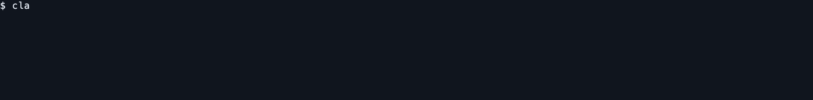

# spider-cloud-agent

An agent that other agents call. It fetches the web through the
[Spider Cloud](https://spider.cloud) API and answers in JSON, in NDJSON, or with
the page content itself. It writes nothing dressed up for a person: no color, no
spinner, no escape codes, no summary paragraph. Results go to stdout,
diagnostics to stderr, and the exit code says which of auth, budget, a refusing
site, transport or output stopped the run.

It picks plain HTTP or a browser locally before spending a call, escalates when a
site refuses, stops on a budget you set, and returns only the fields you asked
for.

No language model runs in this loop. `spider-route` picks the transport from
rules, and the optional parameter scorer in `spider-optimize` is a numeric model
that loads a local artifact of floats and does no I/O while it scores. The
caller is the side holding a language model, so the plumbing costs it no tokens,
and what comes back is bytes a program parses rather than a page someone has to
skim.


A program running `spider-agent`, reading the NDJSON as it arrives, and stopping
on the run report. More scenes, and how to re-record them, in
[media/README.md](media/README.md).

Three crates ship from this workspace:

- `spider-cloud-agent`, the client
- `spider-route`, the local rules that pick request settings
- `spider-agent-cli`, the `spider-agent` command line tool

## Install

```bash
curl -fsSL https://spider.cloud/install/spider-agent.sh | sh
spider-agent --version
```

The script downloads the release build for macOS or Linux on arm64 or x86_64,
checks it against the release's SHA256SUMS.txt, and installs it to the
XDG user bin directory in your home folder. Set `SPIDER_AGENT_INSTALL_DIR`
to install somewhere else, or `SPIDER_AGENT_VERSION` to pin a release. Its source is
[scripts/install.sh](scripts/install.sh).

Or, with a stable Rust toolchain, build it from crates.io:

```bash
cargo install spider-agent-cli
```

See [Cargo.toml](Cargo.toml) for the workspace's toolchain requirement.

## What a calling agent gets

The tool is built to be called, not typed. The contract a caller codes against:

- `--json` writes one document, `{"items": [...], "report": {...}}`. `--ndjson`
  writes one object per line and flushes each, so a caller reads the first page
  of a crawl while the last is still being fetched. The last line is always the
  `report`, which says what the run served, refused and cost.
- The shape does not change with how many results came back, so a caller parses
  one page and a thousand the same way.
- `spider-agent schema` prints the command tree and the record contract as JSON,
  so a caller can discover the commands instead of carrying them hardcoded.
- Exit codes keep a refused key apart from a refused site apart from a budget
  that ran out, so a caller knows whether retrying buys anything.
- No flag carries the API key, because an argument is readable in the process
  list. The key comes from the environment or stdin.

```bash
# one page as JSON
spider-agent scrape https://example.com --json

# a site to NDJSON on disk, one object per line, flushed as each arrives
spider-agent crawl https://example.com --limit 50 --ndjson -o pages.ndjson

# named fields from addresses piped in, no page body over the wire
cat urls.txt | spider-agent extract --selectors fields.json --ndjson

# the command tree and record contract, for a caller to read first
spider-agent schema
```


`spider-agent route <url>` prints the transport it would choose without making a
call, spending nothing and needing no key.


## Driving it from a coding agent

There is no plugin to install and no server to register. A coding agent already
has a shell, and that is the whole interface. The two recordings below are
Claude Code and Codex, run headless with the same task, each working out the
invocation itself and reading the report back.

```bash
claude -p 'Run spider-agent schema, then pull the title, price and stock of each book on the
books.toscrape.com front page, without the page body crossing the wire' --allowed-tools Bash --model sonnet

codex exec -p spider --json '<same task>' | tee turn.jsonl | jq -rs 'map(.item.text? // empty)[-1]'
```

The task names no flag, no subcommand and not even the scheme on the address.
`spider-agent schema` prints the command tree and every record shape as one JSON
document, and both agents read it before they choose anything. Both land on
`extract`, a selectors file they write themselves, and `--json`. That is what the
subcommand is there for, and the last clause of the task is what rules out
downloading the page and grepping it locally.

Two files carry what would otherwise be retyped on every run. `-p spider` is a
Codex profile at `$CODEX_HOME/spider.config.toml`, and without it the fetch dies
inside the default sandbox, which is read only and has no network:

```toml
notify = []
sandbox_mode = "workspace-write"

[sandbox_workspace_write]
network_access = true
```

The shape of the answer lives where each CLI already looks for directions about
the working directory, `CLAUDE.md` for Claude Code and `AGENTS.md` for Codex:

```text
Answer in plain lines and nothing else. No markdown, no fenced blocks, no prose.

1. the command you ran to find out what spider-agent can do
2. the spider-agent command that worked
3. served, refused, cost_credits and elapsed_ms out of its report, as one JSON
   object, credits rounded to six decimals

Selectors go in a file. Nobody can read a command with a JSON document inside it.
```

Codex prints a whole transcript on `--json`, which is what the jq is for. The
`tee` keeps that stream, because the usage block Codex closes it with is where
the token count below comes from.




The `[harness]` line at the bottom of each recording is the recorder talking, not
the model. Choosing that one command cost Claude Code 107 seconds and 670,991
tokens, and Codex 95 seconds and 406,370. The fetch underneath took 1,432 ms and
794 ms and spent no model tokens at all, because no model runs on this side of
the call. What comes back is the record any other caller gets.

## Provider fallback

Store an outside provider once. Every command that fetches pages then sends it as
the `router` parameter. With `--mode fallback`, the provider is tried only when
Spider's own fetch fails. The key is read from stdin, never from an argument.

```bash
printf '%s' "$ZYTE_KEY" | spider-agent router set --provider zyte --mode fallback --funding own --token-stdin
spider-agent router show
```

The caller's own `router` always wins over the stored one. `--no-router`, or
`SPIDER_AGENT_NO_ROUTER` set to any non-empty value, skips the stored router for one
run. `spider-agent router clear` deletes it.

## From Rust

```toml
[dependencies]
spider-cloud-agent = "0.5"
```

```rust
use spider_cloud_agent::{Spider, Need};

let spider = Spider::new()?;

// Markdown, trimmed to fit a context window.
let page = spider.scrape("https://example.com")
    .need(Need::Markdown)
    .max_tokens(4000)
    .send()
    .await?;

// Or just the fields, and the page body never crosses the wire.
let fields = spider.scrape("https://example.com/product/1")
    .need(Need::fields([("price", ".price"), ("title", "h1")]))
    .send()
    .await?;

// The page and the links on it, in one call. `spider-agent --with-links` on
// the command line.
let page = spider.scrape("https://example.com")
    .need(Need::Markdown)
    .page_links(true)
    .send()
    .await?;
let found = page.links.as_deref().unwrap_or_default();
```

## What it does that a plain binding does not

**It chooses the settings.** Plain HTTP is many times cheaper and faster than a
browser, and enough for a lot of pages. Guessing wrong costs you money in one
direction and a failed fetch in the other. `spider-route` decides locally, in
microseconds, from the shape of the request.

**It keeps the two statuses apart.** The API reports how your call went and how
the target site answered, and they share a number. A 403 in the first means your
key is wrong. A 403 in the second means the site blocked you, and there is a
sequence of settings worth trying next.

**It returns less.** The API sends everything unless told otherwise. This crate
sends nothing you did not ask for.

Measured against a recorded 7.8KB product page, against the 9021 bytes you get
by asking for nothing in particular:

| asked for | bytes back | saved |
|---|---|---|
| `Need::fields(...)` | 187 | 97.9% |
| `Need::Metadata` | 350 | 96.1% |
| `Need::Links` | 505 | 94.4% |
| `Need::Text` | 2156 | 76.1% |
| `Need::Markdown` | 2249 | 75.1% |
| `Need::Html` | 4342 | 51.9% |

Regenerate these numbers with the ignored `measured_numbers` test:
`cargo test -p spider-cloud-agent --test thrift_budget measured_numbers -- --ignored --nocapture`,
which reads `spider-cloud-agent/tests/fixtures/thrift/product_page.json` for the
table and `crawl_widgets.json` in the same directory for the crawl below.

Across a six page crawl, dropping the navigation and footer that repeat on every
page takes 5261 bytes to 2269, and 1333 approximate tokens to 509.

Those are byte counts from running the request planner over recorded responses,
so they measure what this crate asks for and returns, not the service.

## How it routes

Deciding whether a page needs a browser takes no language model. `spider-route`
reads the shape of the URL and what happened the last time a similar request
went out, and answers from rules in microseconds. It reads the host once, for its
shape, and keeps no name.

To route another way, implement the `Router` trait.

## Learning cheaper settings

The parameter optimizer is compiled in by default and does nothing until you pass
one to `SpiderBuilder::optimizer`. Start in shadow mode, which scores edits and
sends the baseline request unchanged. `default-features = false` leaves it out.
The caller's settings always win. On the command line, `spider-agent optimize
set --mode shadow` and `--optimize shadow` do the same thing for one machine or
one run, and `--no-optimize` takes it back out. See the [optimizer architecture](docs/optimizer/architecture.md)
for the gates and the evidence needed before applying edits.

## License

MIT. See [LICENSE](LICENSE).
